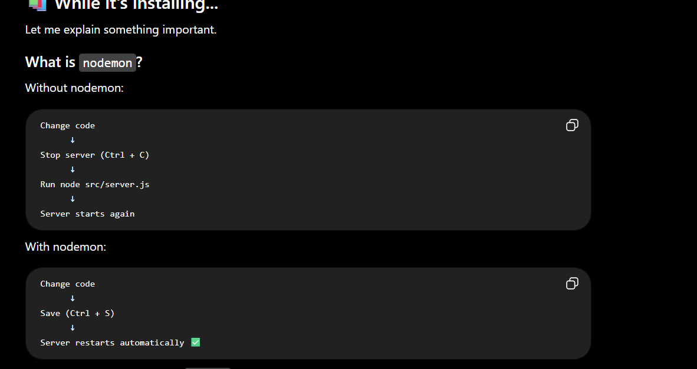

# Cricket League Management System

## Architecture Decisions
---

## Decision #1 - User & Role Relationship

### Decision
One User can have only one Role.

One Role can have many Users.

### Reason

- Simpler authentication.
- Easier authorization.
- Easy to understand.
- Easy to maintain.
- Can be extended later.

### Future

If multiple roles are required, a UserRole mapping table can be introduced.

---

## Decision #2 - Tournament Ownership

### Decision

The logged-in Organizer automatically becomes the Organizer of the Tournament they create.

Two fields will be stored:

- organizerId
- createdBy

### Reason

Simple workflow.

Supports auditing.

Allows future expansion.

---

## Decision #3 - Soft Delete

### Decision

Important records will never be permanently deleted.

Instead, they will be marked using:

- isActive
- status

### Reason

Preserves history.

Maintains reports and statistics.

Supports auditing.

---

## Decision #4 - Venue

### Decision

Venue will be a separate entity.

Matches will reference Venue.

### Reason

One Venue can host many Matches.

One Tournament can have multiple Venues.

Supports Stadiums, School Grounds, Local Grounds and Corporate Grounds.

---

## Decision #5 - Team Logo

### Decision

Images will not be stored in PostgreSQL.

Database stores only:

- logoUrl

Actual image will be stored in cloud/local storage.

### Reason

Better performance.

Smaller database.

Easy migration.

Supports Cloudinary/S3 in future.

---

## Decision #6 - Captain

### Decision

Captain and Vice Captain are Players.

They are not stored as names.

Relationships will be used instead.

### Reason

Avoids duplicate data.

Supports captain changes.

Keeps database normalized.

---------------------------------next session :----------------------

Decision #7----------

Store IDs, not names, when referencing another entity.

Reason:

Prevent duplicate data.
Support updates without changing multiple records.

Decision #8:------

Use junction tables for many-to-many relationships.

Example:

Tournament ↔ Team
(Future) Tournament ↔ Venue if needed.

Reason:

Scalable.
Supports reuse.
Easier to extend.

Decision #9:-------------------

Approval belongs to the relationship, not the entity.

Example:

A team is approved for a tournament, not globally.

-----------------------OUR DATABASE DESIGN :--------------

Role

↓

User

↓

Tournament

↓

TournamentTeam

↓

Team

↓

Player

↓

Venue

↓

Match

↓

Scorecard

↓

Statistics

↓

Notification

13-7-26

## Decision #10 - Primary Key Strategy

### Decision
Use UUID as the primary key for all major entities.

### Reason
- Better security
- Industry standard
- Suitable for distributed systems
- Prevents predictable IDs in APIs

### Example

550e8400-e29b-41d4-a716-446655440000

---------

First Understand the Backend Flow:-------------------

------------ Every request follows this path:----

                Client (Bruno / React)

                        │
                 GET /api/health
                        │
                        ▼
                  Express Server
                        │
                        ▼
                     Routes
                        │
                        ▼
                  Controller
                        │
                        ▼
                    Service
                        │
                        ▼
                 Repository
                        │
                        ▼
                  Prisma Client
                        │
                        ▼
                  PostgreSQL

